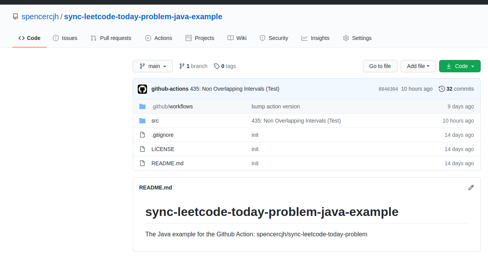
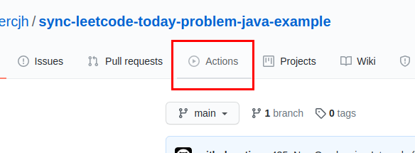
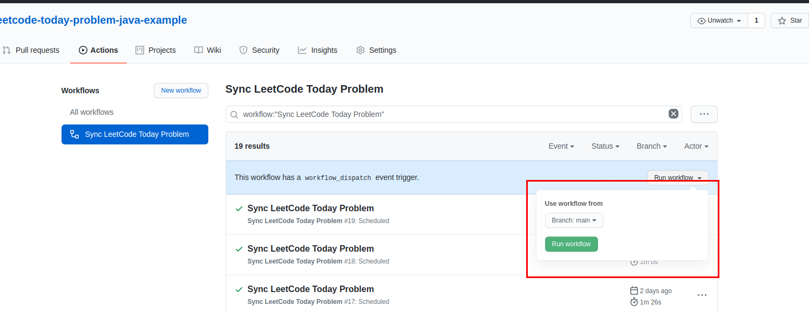

# Sync LeetCode Today Problem


Today Problem (official graphql operation name is Today Record) is a feature only at leetcode-cn.com.

Are you missing the smart IDE during your coding on the web? Do you think the solution is more important than the form of coding such as whiteboard-coding?

**Try this Github Action!**

This action will create a source file of the problem. Currently, the file path is not configurable. (A configurable path for file generation would greatly increase the flexibility of this Action. I will solve it in the near future) It takes you a little time to get more info from the example.

This action can be used not only in empty repo, but also in your existing leetcode solutions repository. 

## Supported languages right now

- [x] Java:[example](https://github.com/spencercjh/sync-leetcode-today-problem-java-example)
- [x] Cpp:[example](https://github.com/spencercjh/sync-leetcode-today-problem-cpp-example)
- [x] Python3:[example](https://github.com/spencercjh/sync-leetcode-today-problem-python3-example)
- [x] Golang:[example](https://github.com/spencercjh/sync-leetcode-today-problem-golang-example)
- [ ] TBD...

## Workflow example

```yaml
name: Sync LeetCode Today Problem

on:
  workflow_dispatch:
  schedule:
    # Runs at 00:01 UTC+8
    - cron: "1 16 * * *"

jobs:
  sync_leetcode_today_record_job:
    name: sync leetcode today problem job
    runs-on: ubuntu-latest
    steps:
      - name: Sync LeetCode Today Problem
        uses: spencercjh/sync-leetcode-today-problem@<latest version>
        with:
          language: Java
```

## How to use

- Prepare a repository



- Create an Action with the example code




- Run it manually now



- See what happened in your repo

- See what happened in your repo tomorrow

## Parameters

### Optional

- github_token
- repository
- branch
- user

### Required

- language: which language of code snippet you want to generate.

## Welcome issues and PR to extend more languages

**If you think it is valuable and meaningful to solve LeetCode Today Problem(record or question, whatever you like to name it in English) with VCS, let Github to record your daily use of LeetCode, welcome to contribute this little project.**

The language format is **upper-camel-case**. Here are the examples: `Cpp`,`JavaScript`,`Php`,`Kotlin`. The language name in the python file name has to obey python style: **snake-case** , for example: `cpp_leetcode_problem.py`.

Just override class `LeetCodeProblem` and sync your language's problems!
